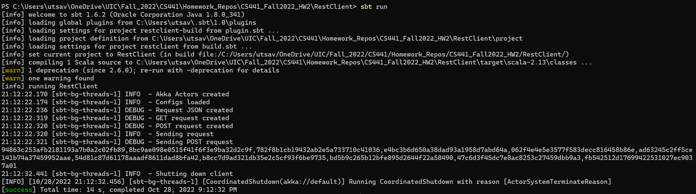

# CS441_Fall2022_HW2
## Utsav Sharma
### UIN: 665894994
### NetID: usharm4@uic.edu

Repo for the REST and gRPC homework-2 for CS411-Fall2022

---

Video link: https://youtu.be/3wvKWLq0N0w

---
## Running the project
1) Download the repo from git.
2) To compile RestClient, navigate to its directory and run `sbt clean compile`
3) To compile gRPCServer, navigate to its directory and run `sbt clean compile`
4) To compile gRPCClient, navigate to its directory and run `sbt clean compile`
5) To compile LogFileGenerator, navigate to its directory and run `sbt clean compile`
6) To run the REST Client, navigate to the RestClient directory and launch a terminal. From the terminal, run `sbt run`.
7) To run the gRPCServer locally, navigate to the project directory and launch a terminal. From the terminal, run `sbt run`. Once this is running, navigate to `\src\main\resources` in the gRPCClient directory first and change `RemoteServer` to **0** in `application.conf`, after which you can launch a terminal in the root of the project the gRPCClient directory and launch a terminal, in which you run `sbt run`.
8) To run the gRPCServer using an EC2 instance, ssh to your EC2 instance and navigate to the gRPCServer directory, where you run `sbt run`. Once this is running, navigate to `\src\main\resources` in the gRPCClient directory on your local machine first and change `RemoteServer` to **1** and `RemoteURL` to the IP address of the EC2 instance  in `application.conf`, after which you can launch a terminal in the root of the project the gRPCClient directory in which you run `sbt run`. (You will need to scp the project in the manner described later in this document)
9) To run LogFileGenerator, navigate to its directory and run `sbt run`
10) To test, run `sbt test` through the terminal in the RestClient directory.
---
## Requirements:
1) Create a Lambda function to identify if a timestamp is present in the log file with a complexity of O(log n), and then check within that timestamp for any strings matching the given regex pattern.
2) Invoke the Lambda function through REST methods. 
3) Invoke the Lambda function using a gRPC Client and Server. 
4) Deploy the LogFileGenerator on an EC2 instance and store the log file in an S3 bucket.

Other Requirements:
1) 5 or more scalatests should be implemented.
2) Logging used for all programs.
3) Configurable control variables (Time intervals, Time, etc).
4) Compileable through sbt.

## Technical Design

We will take a look at how each of these requirements were fulfilled below. Comments are also present in the code:

1) ### Lambda.py
This is the lambda function that takes our input of the time 'T' and the time interval 'dT'. Then, it fetches the log file from the s3 bucket and takes a few bytes of data from the start and end of the file.
The timestamp is then extracted, and compared to the lower bound and upper bound of time calculated from 'T' and 'dT' using `datetime`, which enables us to use simple `<=` and `>=` operators for time comparison. If we find that the lower bound and upper bound are within the start and end of the log file, we convert our times to seconds, extract those messages from the log file and check if those messages have the regular expression pattern that we defined in them.
The messages that we match are converted to a md5 hash and sent back in the response with status code `200`. In case we find that the log file does not have the time range that we requested for, the Lambda function sends a status code of `404` with the error message `The time window does not exist in this log file`.
The function makes use of environment variables for all configuration variables and uses `print()` to write logs, which is automatically included in the CloudWatch logs for the Lambda function.
The Environment Variables can be set on the `Configuration` tab of the Lambda function as shown:


2) ### LogFileGenerator:
LogFileGenerator is the program that we use to generate the log files, and is deployed on an EC2 instance. This program runs on the Ubuntu VM that we spin up, and generates a log file in its `/log/` directory. Once the file has been generated, it is converted from Unix to DOS format for compatibility and copied over to our S3 bucket with the name `input.log`, which is what our Lambda function expects.
To automate the process of running this program and copying the file, there is a runlog.sh shell script that I have created which can be called using `bash runlog.sh` in the EC2 instance.

To create the EC2 instance for our specific needs, we have to follow the below steps:
1) Launch EC2 instance with Ubuntu that is at least a t2.medium (I have tried t2.micro, and gave up on waiting for it to finish compiling after over an hour).
2) Choose `<your key name>` as the key.
3) Convert `<your key name>.ppk` to `.pem` using puttyGen.
4) Connect to the EC2 instance using ```ssh -i <the filepath to your .pem> ubuntu@<your EC2 instance>```  and install scala, java, sbt and the AWS CLI:
```
	sudo apt-get update
	sudo apt-get -y install openjdk-8-jdk
	export JAVA_HOME=/usr/lib/jvm/java-8-openjdk
	echo "deb https://dl.bintray.com/sbt/debian /" | sudo tee -a /etc/apt/sources.list.d/sbt.list
	sudo apt-key adv --keyserver hkp://keyserver.ubuntu.com:80 --recv 2EE0EA64E40A89B84B2DF73499E82A75642AC823
	sudo apt-get update
	sudo apt-get install apt-transport-https curl gnupg -yqq
	echo "deb https://repo.scala-sbt.org/scalasbt/debian all main" | sudo tee /etc/apt/sources.list.d/sbt.list
	echo "deb https://repo.scala-sbt.org/scalasbt/debian /" | sudo tee /etc/apt/sources.list.d/sbt_old.list
	curl -sL "https://keyserver.ubuntu.com/pks/lookup?op=get&search=0x2EE0EA64E40A89B84B2DF73499E82A75642AC823" | sudo -H gpg --no-default-keyring --keyring gnupg-ring:/etc/apt/trusted.gpg.d/scalasbt-release.gpg --import
	sudo chmod 644 /etc/apt/trusted.gpg.d/scalasbt-release.gpg
	sudo apt-get update
	sudo apt-get install sbt
	curl "https://awscli.amazonaws.com/awscli-exe-linux-x86_64.zip" -o "awscliv2.zip"
	sudo apt intall unzip
	unzip awscliv2.zip
	sudo ./aws/install
```
5) Copy over project folder to the EC2 instance using `scp -r -i <filepath to your project .zip> ubuntu@<your EC2 instance>>:~/<project>.zip`
6) Use `unzip <project>.zip` to unzip the project
7) `cd` to the project directory and run `runlog.sh`
#### Note: It is usually the case that when a file such as a shell script is created on a Windows machine, it does not work as expected in Linux. Therefore, one has to use `dos2unix` to convert the file. An easier method would be to create the file in Linux itself using `nano`.

3) ### RestClient:
RestClient invokes the lambda function through `GET` and `POST` methods. The user starts with defining their time 'T' and time interval 'dT' in the `application.conf` file, along with the type of request that they want to perform.
The program then constructs `GET` and `POST` requests, and decides which one to use depending on the `Type` configuration under `request` in the `application.conf` file. The `POST` request sends the inputs as a JSON, while the `GET` includes our inputs in the request URI.
Once the request is sent, the program goes to sleep for `10000 ms` and then terminates, to allow the future to have enough time to complete.
Keeping in line with our requirements, the RestClient program uses Logback for logging, which creates a log file in the `/log` directory of the project. The configurations can be controlled from the `application.conf` file. This function was made using the guide for Akka HTTP from https://blog.rockthejvm.com/a-5-minute-akka-http-client/
The output for this program is below:

#### POST - Success:


#### POST - Failure:


#### GET - Success:


#### GET - Failure:


4) ### gRPCServer:
This is the client program for using a Client-Server RPC architecture to call our Lambda function. It is actually both a server and a client, since it uses Akka HTTP to forward the request it receives to the Lambda function for processing.
Here, we create a protobuf using ScalaPB, and bootstrap our server to a port on `localhost`. The port is defined in the `application.conf` file and is configurable. The stub then has its service implementations bound to the server, which enables calling of the Lambda function when the request is received.
The lambda function itself is called using Akka HTTP, similar to the RestClient implementation. I used the sample code from https://github.com/xuwei-k/grpc-scala-sample to create the server, because it was easy to understand and implement.

The server is then deployed on an EC2 instance with the same `scp` method (step 5 and 6) like LogFileGenerator, and we run it by accessing the EC2 instance through the AWS CLI, navigating to the project directory and using `sbt run`. To enable this, we have to add a rule to our security group for `Custom TCP` on the port that we have configured in `application.conf`. 
Like the other programs, we use `application.conf` to control our configuration variables and Logback to generate the logs in the `/log` directory.
This program has to be run before the gRPCClient so that it can serve requests, and stays alive until the user terminates it. 

5) ### gRPCClient:
This is the client program in our Client-Server RPC architecture. We use the same protobuf to generate the stub as the gRPCServer using ScalaPB, and send requests to our gRPCServer. The URL and Port of the server are configured in `application.conf` under `gRPCClient`.
To create the request, we take the time 'T' and time interval 'dT' that are configured in `application.conf` under `request` and then send a synchronous RPC call to our gRPCServer. Once a response is received, we print that to our logs and to the console.

Since the gRPCServer can be run locally on `localhost` or on an EC2 instance like I am doing here, there is a configuration in `application.conf` called `RemoteServer`. Setting this to **1** means that the program will try to connect to the gRPCServer using the configuration `URLRemote`. Setting it to **0** will make it attempt to connect to the gRPCServer on localhost.
One important thing to note here is that if you stop and start your EC2 instance, the IP addresses change, which is why it is important to update `URLRemote` everytime this is done.
The sample code for this was also from https://github.com/xuwei-k/grpc-scala-sample.
The logs are generated using Logback in the `/log` directory, and the server and request parameters can be controlled through `application.conf`
The response that we receive is below:

#### Success:


#### Failure:


## Test Cases
These are run through the command `sbt test`.

| Case No. | Test Name                                                                | Test Steps                                                                                                                                                                                                                                         | Expected Result                                             | Actual Result                                                             | Pass/Fail |
|----------|--------------------------------------------------------------------------|----------------------------------------------------------------------------------------------------------------------------------------------------------------------------------------------------------------------------------------------------|-------------------------------------------------------------|---------------------------------------------------------------------------|-----------|
| 1 | Check if application.conf file is present                                | (1.) Load config file application.conf <br> (2.) Assert that the file is present                                                                                                                                                                   | The file is present.                                        | The file is present in the /resources directory.                          | Pass |
| 2 | Unit test for request configuration existing                             | (1.) Load config file application.conf <br> (2.) Load the request configs <br> (3.) Assert that the config variables are not empty                                                                                                                 | The configs for request are present.                        | The configs for request are present.                                      | Pass |
| 3 | Unit test for Lambda configuration existing                              | (1.) Load config file application.conf <br> (2.) Load the Lambda configs <br> (3.) Assert that the config variables are not empty                                                                                                                  | The configs for lambda are present.                         | The configs for lambda are present.                                       | Pass |
| 4 | Unit test for request type existing and being of either GET or POST type | (1.) Load config file application.conf <br> (2.) Load the request configs <br> (3.) Assert that the config is not empty and that the config equals "GET" or "POST"                                                                                 | The request type is not empty and is either 'GET' or 'POST' | The request type is not empty and is either 'GET' or 'POST'               | Pass |
| 5 | Unit test for the time input being set                                   | (1.) Load config file application.conf <br> (2.) Load the string for configuration 'T' <br> (3.) Assert that the config is not empty                                                                                                               | The config for time input is present.                       | The config for time input is present.                                     | Pass |
| 6 | Unit test for injected regex positive                                    | (1.) Load config file application.conf <br> (2.) Load the injected regex pattern from functionality configs <br> (3.) load the sample log string with the regex to be found <br>(4.)  Assert that the string matches the regex pattern             | The regex pattern should match                              | The regex pattern matches.                                                | Pass |
| 7 | Unit test for injected regex negative                                    | (1.) Load config file application.conf <br> (2.) Load the injected regex pattern from functionality configs <br> (3.) load the sample log string with the regex to be found <br>(4.)  Assert that the string should not match the regex pattern    | The regex pattern should not match                          | The regex pattern does not match.                                         | Pass |
| 8 | Unit test for the time interval being set                                | (1.) Load config file application.conf <br> (2.) Load the string for configuration 'T' <br> (3.) Assert that the config is not empty                                                                                                               | The config for time interval is present.                    | The config for time interval is present.     | Pass |
| 9 | Unit test for the API Gateway URL being set          | (1.) Load config file application.conf <br> (2.) Load the Lambda configs <br> (3.) Assert that the config for invokeURL is not empty                                                                                                               | The URL for the API Gateway is present.                     | The URL for the API Gateway is present. | Pass |
---
